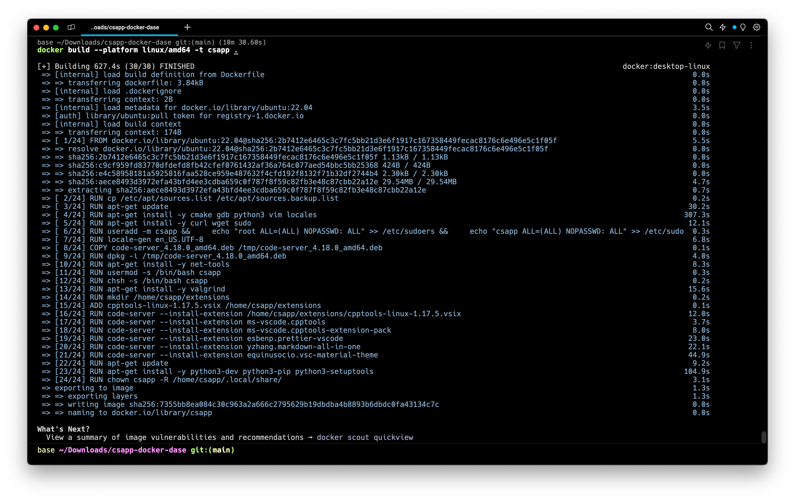
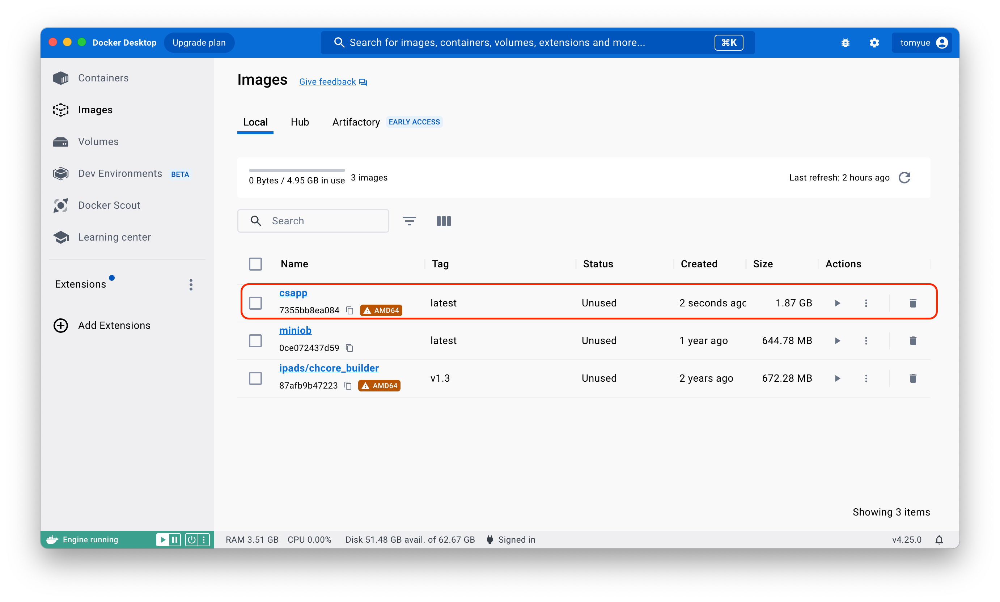

# DaSE CSAPP VSCode on Docker

> CSAPP Dockerfile for DaSE


## 使用方法

### 安装本地的docker desktop

下载链接：https://www.docker.com/products/docker-desktop/，根据您使用的操作系统选择对应的版本下载，如下图所示。


下载完后应该可以看到长成这样很可爱的小🐳鲸鱼的图标，然后让我们点击它。点击之后，docker的启动会需要一点时间，所以给点时间给我们可爱的小鲸鱼。

当你看到docker desktop的左下角的小鲸鱼🐳图标变成绿色的时候，就代表它已经启动了，如下图所示。【括号里的内容可以略过：变为绿色代表docker dameon守护进程已经启动，相当于你手动在本机的命令行中输入了`systemctl start docker`】

好，那到目前为止，我们安装docker小鲸鱼🐳的过程就结束了，接下来我们去把小鲸鱼🐳的食物（dockerfile）给下载下来吧，见后面的小节。


## 安装Git Large File Storage

下载指导链接：https://git-lfs.com/，Github官方教程链接：https://docs.github.com/en/repositories/working-with-files/managing-large-files/installing-git-large-file-storage


因为众所周知的原因，我们下载某些软件总是会面临中断、连不上、网络错误等失败，所以我们事先把要用Docker中要使用到的软件包下载下来并放到了Github 仓库中，但是由于这个包有97.3MB的大小，属于大型文件，所以在Github 仓库中上传和下载时都会有一些不同的地方，比如原本的`git clone`指令就要变成`git lfs clone`。所以为了能够支持大型文件的下载克隆，我们需要实现安装一个git-lfs如上图的网址所示，如何下载会根据你的电脑操作系统不同而有所区别，上图为我的mac电脑的安装方式。


### 构建Docker镜像依据我们编写的Dockerfile

#### 命令：

```bash
> git lfs install # 使用此指令确认你已经安装了git lfs
> git lfs clone https://github.com/TOMYUE/csapp-docker-dase.git csapp-docker
> cd csapp-docker
> docker build --platform linux/amd64 -t csapp . 
#这条命令会让docker默认按照当前目录下的Dockerfile启动Docker容器，并且指定在amd64架构下
```

#### 命令解释：

1. 克隆仓库到本地：`git lfs clone https://github.com/TOMYUE/csapp-docker-dase.git` 或者如果你配置过Github的ssh key的话使用`git lfs clone git@github.com:TOMYUE/csapp-docker-dase.git`，在不能科学上网的情况下，ssh也是可以很快速的使用的，没配置过的话推荐配置一下，因为仅依靠https下载是个玄学事件。同时这份clone任务不会很快能执行完，因为其中包含了一份我事先加入的cpptools-linux-1.17.5.vsix的给vscode code_server的插件，这份插件比较大所以麻烦各位耐心了。


2. 构建并运行docker: `docker build --platform linux/amd64 -t csapp .` 

   ​		命令本身上，在这里我们**使用 `--platform` 标志**：在 `docker build` 命令中使用 `--platform linux/amd64` 标志来明确指定要构建的是 `amd64` 平台的镜像。`-t csapp`: 是一个选项，用于为构建的镜像指定一个标签（tag）。在这里，`csapp` 是镜像的名称，我们可以根据需要自定义，比如你取名为`-t ILoveYou`或者`-t LOL`都是可以的，随你啦。总之，标签是用来标识镜像的可读性标识符，最好取名为有意义方便你快速识别的名称。

   ​		对于这条命令具体做了什么，简单来说就是按照我在dockerfile里写的一行行的指令去执行对应的操作，仅此而已，没有任何神秘的地方。

   ​		这里放心大胆的敲这行命令就行了，不要恐惧，需要注意⚠️的是这个运行可能会有点长（我自己运行了10min左右，627.4s），所以耐心一点。下图是整个运行过程的记录截图，你可以观察一下，其中还有每一步构建所花费的时间，可以看一下：

   ​		构建好后，在你的Docker Desktop中你还能看到多出来一个镜像(Docker Image)，如下图所示：

   ​		那么接下来就是我们的最后一步了，把它给跑起来，看下一节😄。


## 运行我们构建的镜像

