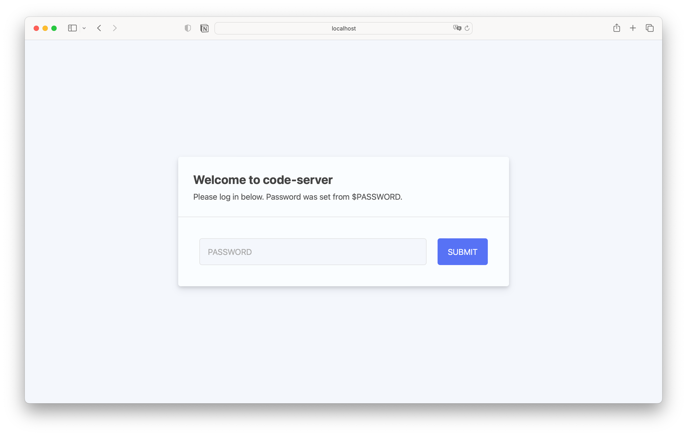
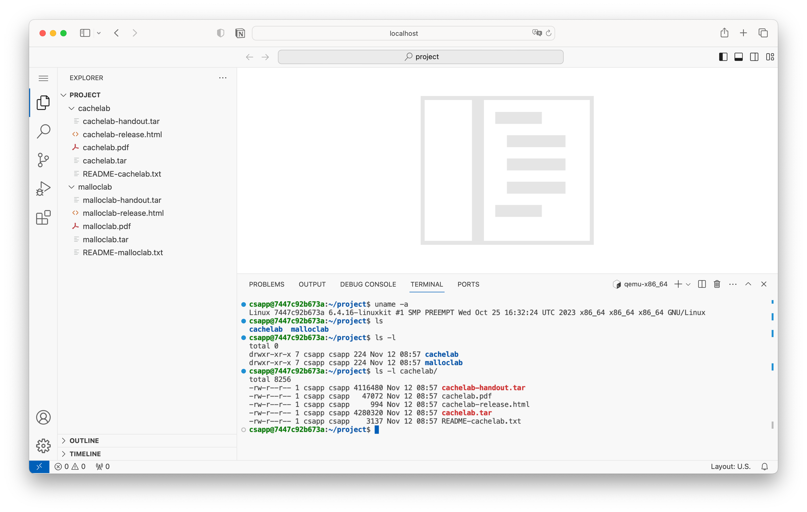

# DaSE CSAPP VSCode on Docker

> CSAPP Dockerfile for DaSE


## 说明

这是一个可能能够方便cachelab和malloclab开发的办法，通过这个方法各位在自己的浏览器中获得一个在ubuntu22.04中工作的vscode，方便使用IDE的调试工具进行更加方便的调试。


⚠️：使用还辛苦看一下写的指导书了：https://github.com/TOMYUE/csapp-docker-dase/blob/main/DaSE-CSAPP-Docker-vsc-Build-Guide.pdf 所有需要的安装工具（Docker Desktop和git lfs）和步骤，我已经尽力写在其中了，如果有任何不清楚的地方随时和我说，麻烦各位了。


## 使用方法

```bash
> git lfs install # 使用此指令确认你已经安装了git lfs
> git lfs clone https://github.com/TOMYUE/csapp-docker-dase.git csapp-docker
> cd csapp-docker
> docker build --platform linux/amd64 -t csapp . 
> docker run -p 8765:8765 -v "./labs:/home/csapp/project" csapp
# 然后去浏览器打开localhost:8765
```



